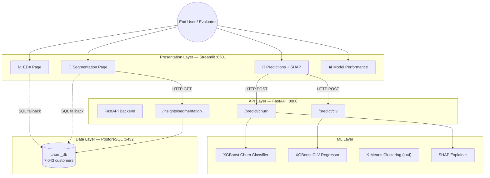

# 📊 Intelligent Customer Lifetime Value & Churn Prediction Platform

> An end-to-end machine learning platform for customer segmentation, lifetime value prediction, churn prediction, and business intelligence — built for the Telco industry.

---

## 🧩 Architecture



---

## 🚀 How to Run

### Option 1 — Local Python (No Docker required)

```bash
# 1. Install dependencies
pip install -r requirements.txt

# 2. Launch the Streamlit dashboard
python -m streamlit run dashboard/app.py
```

Open **http://localhost:8501** in your browser.

> The dashboard automatically falls back to the local Excel file
> (`data/Telco_customer_churn.xlsx`) if the database is not running.

---

### Option 2 — Full Docker Stack (Recommended for evaluation)

```bash
# 1. Build and start all three services (DB + API + Dashboard)
docker-compose up --build

# 2. In a second terminal — seed the PostgreSQL database
docker-compose exec api python database/seed_db.py
```

| Service   | URL                          |
|-----------|------------------------------|
| Dashboard | http://localhost:8501        |
| API Docs  | http://localhost:8000/docs   |
| Database  | `localhost:5432` / `churn_db`|

---

## 📁 Project Structure

```
customer_churn-Prediction/
├── api/                        # FastAPI backend
│   ├── main.py                 # Application entry point
│   └── routes/
│       ├── predict.py          # /churn and /clv endpoints
│       └── insights.py         # Segmentation summary endpoint
├── dashboard/                  # Streamlit frontend
│   ├── app.py                  # Main app entry point
│   └── pages/
│       ├── 1_eda.py            # Exploratory Data Analysis
│       ├── 2_segmentation.py   # K-Means cluster visualizations
│       ├── 3_predictions.py    # Live predictions + SHAP explanations
│       └── 4_model_performance.py  # Model evaluation report card
├── database/
│   ├── connection.py           # SQLAlchemy engine setup
│   ├── models.py               # ORM Customer model
│   └── seed_db.py              # Populates PostgreSQL from Excel
├── ml/
│   ├── data_preprocessing.py   # Feature engineering pipeline
│   ├── churn_prediction.py     # XGBoost churn model training
│   ├── clv_prediction.py       # XGBoost CLV model training
│   ├── segmentation.py         # K-Means clustering
│   └── generate_plots.py       # Static visualization generation
├── models/                     # Serialized .pkl model files
├── data/                       # Raw dataset (Telco_customer_churn.xlsx)
├── visualizations/             # Static PNG charts
├── tests/                      # Pytest unit tests
├── docker-compose.yml
├── Dockerfile.api
├── Dockerfile.dashboard
└── requirements.txt
```

---

## 🤖 Model Performance

| Model | Algorithm | Key Metrics |
|-------|-----------|-------------|
| **Churn Prediction** | XGBoost Classifier | Accuracy: **80.77%** \| ROC AUC: **0.854** \| F1 (churn): **0.61** |
| **CLV Estimation** | XGBoost Regressor | R²: **0.9986** \| MAE: **$57.91** \| MSE: **7,111** |
| **Segmentation** | K-Means (k=4) | 7,043 customers segmented into 4 behavioral groups |

---

## 🔍 SHAP Explainability

The Predictions page includes an interactive **SHAP (SHapley Additive exPlanations)** panel.
For each customer, it shows the top 10 features driving the churn prediction, with
red bars indicating features pushing toward churn and blue bars indicating retention signals.

---

## 🧪 Running Tests

```bash
python -m pytest tests/ -v --tb=short
```

Tests cover:
- `test_ml_preprocessing.py` — feature engineering, encoding, scaling pipeline
- `test_api.py` — FastAPI endpoint responses with mocked DB and models

---

## 🛠️ Tech Stack

| Layer | Technology |
|-------|-----------|
| Frontend | Streamlit, Plotly |
| Backend API | FastAPI, Uvicorn |
| Machine Learning | XGBoost, Scikit-learn, SHAP |
| Database | PostgreSQL 15, SQLAlchemy |
| Containerization | Docker, Docker Compose |
| Data | Kaggle Telco Customer Churn Dataset (7,043 records) |

---

## 📌 Problem Statement

Customer retention is one of the biggest challenges in the telecommunications industry.
Without predictive analytics, organizations invest equally in all customers, leading to
inefficient marketing campaigns and missed retention opportunities. This platform uses
machine learning to:

- **Predict** which customers are likely to churn (with probability scores)
- **Estimate** the lifetime value of each customer
- **Segment** customers into actionable behavioral groups
- **Explain** predictions using SHAP feature attributions
- **Visualize** all insights in an interactive business dashboard
