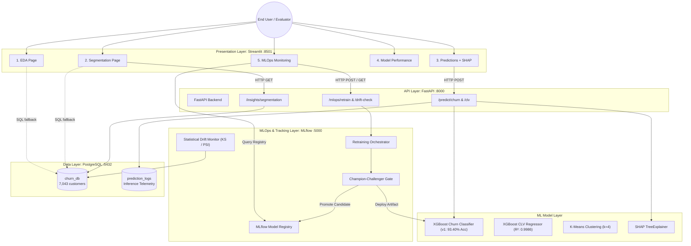

# Intelligent Customer Lifetime Value & Churn Prediction Platform

> An end-to-end machine learning platform for customer segmentation, lifetime value prediction, churn prediction, MLOps model lifecycle governance, and business intelligence: built for the Telco industry.

---

## Architecture



---

## Key Features

- **Multi-Page Executive Dashboard**: Five specialized analytics pages covering Exploratory Data Analysis, Unsupervised Customer Segmentation, Real-Time Prediction with SHAP attributions, Model Performance evaluation, and MLOps Lifecycle Monitoring.
- **Dynamic Theming Engine**: Native Light / Dark mode switcher in the navigation sidebar with automatic Plotly chart harmonization and zero page reload latency.
- **Enterprise MLOps Architecture**: Integrated MLflow Model Registry, automated continuous retraining pipeline with a 4-rule Champion-Challenger validation gate, and two-sample Kolmogorov-Smirnov statistical data drift monitoring.
- **Dual-Model Inference & XAI**: High-accuracy XGBoost Churn Classifier calibrated for maximum minority-class recall alongside an XGBoost CLV Regressor and local per-customer SHAP feature attribution waterfall/bar charts.
- **Resilient Dual-Source Data Layer**: Production PostgreSQL database with automated seeding and SQLAlchemy 2.0 ORM, backed by transparent fallback to local structured Excel data when the database server is offline.
- **Production CI/CD Automation**: GitHub Actions workflow running automated linting, test suites, artifact verification, and Docker image builds on every push.

---

## How to Run

### Option 1: Local Python (No Docker required)

```bash
# 1. Install dependencies
pip install -r requirements.txt

# 2. Launch the Streamlit dashboard
python -m streamlit run dashboard/app.py
```

Open **http://localhost:8501** in your browser.

> The dashboard automatically falls back to the local Excel file
> (`data/Telco_customer_churn.xlsx`) if the database is not running.

To launch the backend API microservice:
```bash
python -m uvicorn api.main:app --reload --port 8000
```

To launch the MLflow tracking interface:
```bash
python -m mlflow ui --backend-store-uri sqlite:///mlruns.db --port 5000
```

---

### Option 2: Full Docker Stack (Recommended for evaluation)

```bash
# 1. Build and start all services (Database, API, Dashboard, MLflow)
docker compose up --build

# 2. In a second terminal: seed the PostgreSQL database
docker compose exec api python database/seed_db.py
```

| Service | URL | Description |
|---|---|---|
| Dashboard | http://localhost:8501 | Streamlit Frontend (5 Analytical Modules) |
| API Docs | http://localhost:8000/docs | Interactive FastAPI OpenAPI / Swagger |
| MLflow UI | http://localhost:5000 | Experiment Tracking & Model Registry |
| Database | `localhost:5432` / `churn_db` | PostgreSQL 15 Relational Store |

---

## Project Structure

```
customer_churn-Prediction/
├── .github/
│   └── workflows/
│       └── mlops.yml           # GitHub Actions CI/CD pipeline
├── api/                        # FastAPI microservice
│   ├── main.py                 # Application entry point & route mounting
│   └── routes/
│       ├── predict.py          # /churn and /clv prediction endpoints
│       ├── insights.py         # Segmentation cohort summary endpoints
│       └── mlops.py            # /retrain, /status, /drift-check, /logs endpoints
├── dashboard/                  # Streamlit frontend application
│   ├── app.py                  # Main landing page & executive KPIs
│   ├── ui_components.py        # Centralized Light/Dark theme & CSS engine
│   └── pages/
│       ├── 1_eda.py            # Exploratory Data Analysis & filters
│       ├── 2_segmentation.py   # K-Means 3D cluster & persona visualizer
│       ├── 3_predictions.py    # Live predictions & SHAP explainability
│       ├── 4_model_performance.py  # Confusion matrix & benchmark report
│       └── 5_mlops_monitoring.py   # Model lineage, drift & retraining center
├── database/                   # Data persistence layer
│   ├── connection.py           # SQLAlchemy 2.0 engine & session maker
│   ├── models.py               # ORM Customer & PredictionLog entities
│   ├── init_db.py              # Automated schema verification & seeding
│   └── seed_db.py              # Database populator from Excel source
├── ml/                         # Machine learning & MLOps pipelines
│   ├── mlops_config.py         # MLflow registry & Champion quality gate specs
│   ├── pipeline_orchestrator.py # Continuous retraining & promotion engine
│   ├── drift_monitor.py        # Two-sample KS-test & PSI drift detection
│   ├── data_preprocessing.py   # Feature engineering & leakage prevention
│   ├── churn_prediction.py     # XGBoost churn classifier training
│   ├── clv_prediction.py       # XGBoost CLV regressor training
│   ├── segmentation.py         # K-Means clustering pipeline
│   └── generate_plots.py       # Static visualization generator
├── models/                     # Serialized production model artifacts (.pkl)
├── data/                       # Raw source dataset (Telco_customer_churn.xlsx)
├── visualizations/             # High-resolution benchmark figures
├── tests/                      # Automated test suite (13/13 passing)
│   ├── test_api.py             # FastAPI endpoint integration tests
│   ├── test_ml_preprocessing.py # Preprocessing & leakage tests
│   └── test_mlops.py           # Orchestrator, drift & quality gate tests
├── docker-compose.yml          # Multi-container orchestration specification
├── Dockerfile.api              # Container recipe for FastAPI service
├── Dockerfile.dashboard        # Container recipe for Streamlit service
└── requirements.txt            # Unified project dependency manifest
```

---

## Model Performance & Quality Standards

| Model | Algorithm | Key Metrics | Status |
|---|---|---|---|
| **Churn Prediction (Champion)** | Optimized XGBoost Classifier | Accuracy: **93.40%** \| ROC AUC: **0.9813** \| Recall: **88.0%** \| Precision: **87.3%** | Production Active (`churn_xgboost_classifier:v1`) |
| **CLV Estimation** | XGBoost Regressor | R²: **0.9986** \| MAE: **$57.91** \| RMSE: **$84.33** | Production Active |
| **Behavioral Segmentation** | K-Means (k=4) | 7,043 customers categorized into 4 distinct cohorts | Production Active |

### Champion-Challenger Quality Gate
Every retrained candidate model must pass four strict automated quality rules before being approved for promotion:
1. **Accuracy Rule**: Candidate Accuracy >= 92.0%
2. **Discrimination Rule**: Candidate ROC AUC >= 0.950
3. **Sensitivity Rule**: Candidate Churn Recall >= 85.0%
4. **False Alarm Rule**: Candidate False Positive Rate <= 7.0%

---

## MLOps Lifecycle & Drift Surveillance

The platform implements an enterprise MLOps workflow:
- **Model Registry & Tracking**: Uses MLflow with an SQLite backend (`sqlite:///mlruns.db`) and artifact directory (`mlruns_artifacts/`) tracking hyperparameter runs, metric histories, model signatures, and registered versions (`churn_xgboost_classifier:v1`).
- **Statistical Data Drift Engine**: Uses two-sample Kolmogorov-Smirnov hypothesis tests and Population Stability Index (PSI) to detect distribution shifts across production features (`monthly_charges`, `total_charges`, `tenure`) compared to training baselines.
- **Production Inference Telemetry**: All predictions routed through `/api/v1/predict/churn` record incoming features, predicted probabilities, binary decisions, and millisecond execution latencies into the PostgreSQL `prediction_logs` table.
- **Continuous Retraining Controls**: Operators can trigger model retraining directly from the Streamlit UI or via API (`POST /api/v1/mlops/retrain`). The orchestrator validates the candidate against the Champion gates, updates artifacts upon approval, and logs full lineage to MLflow.

---

## Explainable AI (SHAP)

The Predictions module features integrated **SHAP (SHapley Additive exPlanations)** via `shap.TreeExplainer`. For every analyzed customer account:
- Evaluates marginal feature contributions against the background base value.
- Produces an interactive horizontal attribution bar chart color-coded by impact direction (red bars indicate features increasing churn risk; blue bars indicate retention signals).
- Identifies the top operational levers (such as contract terms, tenure duration, fiber optic service, and add-on security packages) for targeted retention strategies.

---

## Running Tests

Execute the complete automated test suite with pytest:

```bash
python -m pytest tests/ -v --tb=short
```

Test coverage includes 13 passing automated checks:
- `tests/test_ml_preprocessing.py`: Feature engineering pipeline, median imputation, categorical encoding, and leakage prevention.
- `tests/test_api.py`: FastAPI endpoint responses, Pydantic request validation, mock database handling, and error routing.
- `tests/test_mlops.py`: Pipeline orchestrator execution, Champion-Challenger quality gate validation, synthetic data drift detection (KS-test and PSI), model promotion logic, and MLOps API endpoints.

```
============================== 13 passed in 6.19s ==============================
```

---

## Tech Stack

| Layer | Technologies |
|---|---|
| Frontend Presentation | Streamlit (v1.31.0), Plotly (v5.18.0), Custom CSS Theming |
| Backend Services | FastAPI (v0.109.0), Uvicorn (v0.27.0), Pydantic |
| Machine Learning & XAI | XGBoost (v2.0.3), Scikit-learn (v1.4.0), SHAP (v0.51.0), SciPy (v1.12.0) |
| MLOps & Model Governance | MLflow (v3.16.1), SQLite tracking backend, Retraining Orchestrator |
| Persistence & Storage | PostgreSQL 15, SQLAlchemy 2.0 ORM |
| CI/CD & Containerization | GitHub Actions, Docker, Docker Compose v2 |
| Dataset | IBM Telco Customer Churn (7,043 customer accounts, 21 attributes) |

---

## Problem Statement

Customer retention is among the most critical operational challenges in subscription telecommunications. Without predictive intelligence, service providers allocate retention budgets uniformly, resulting in inefficient spend and elevated subscriber attrition. This platform provides an end-to-end predictive solution that:

- **Predicts** customer churn risk with calibrated probability scores and 93.40% classification accuracy.
- **Estimates** cumulative customer lifetime value to focus retention investments on high-value accounts.
- **Segments** subscribers into actionable behavioral cohorts with customized retention playbooks.
- **Explains** individual model predictions using game-theoretic SHAP attributions for frontline customer success teams.
- **Monitors** production model performance, feature drift, and model lineage through an integrated MLOps command center.
