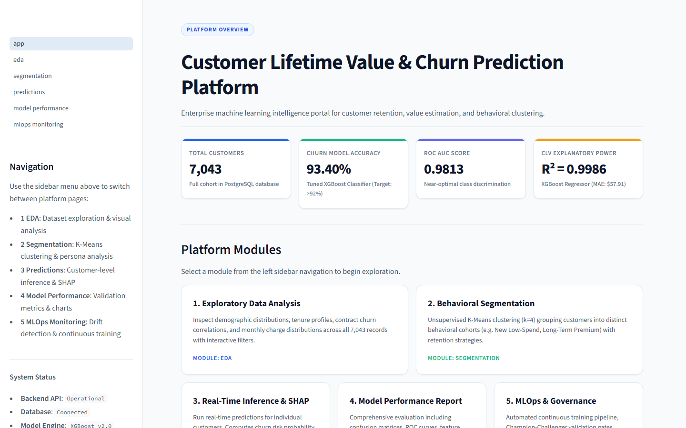
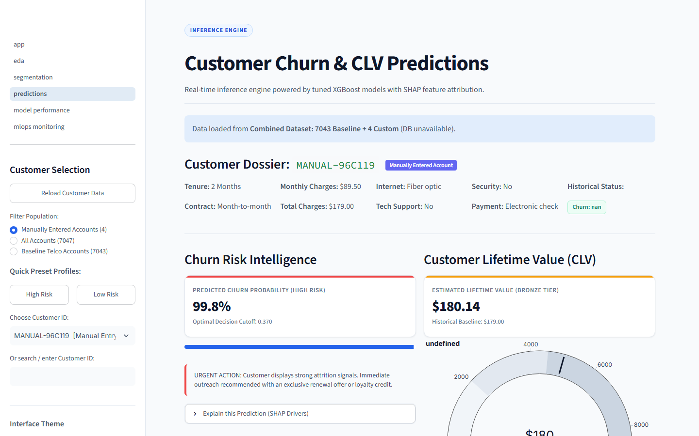
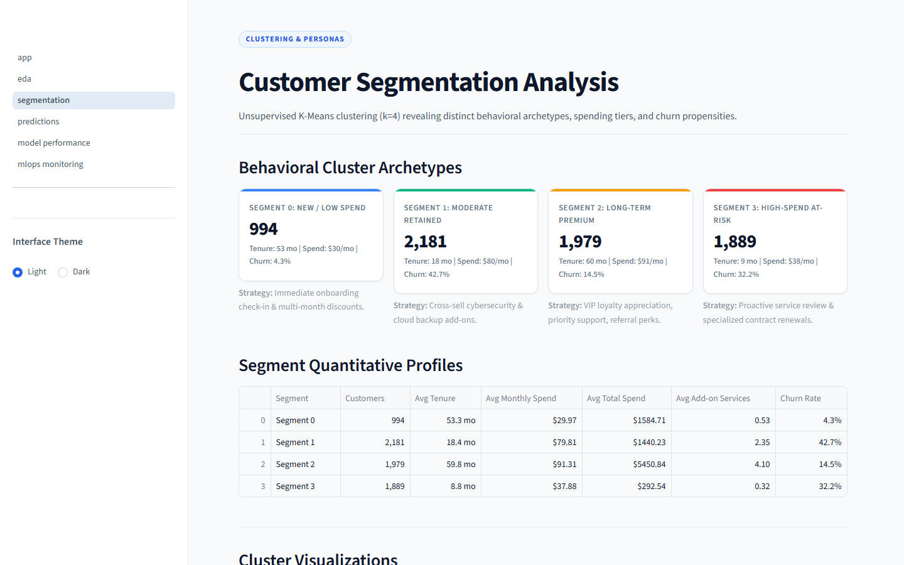
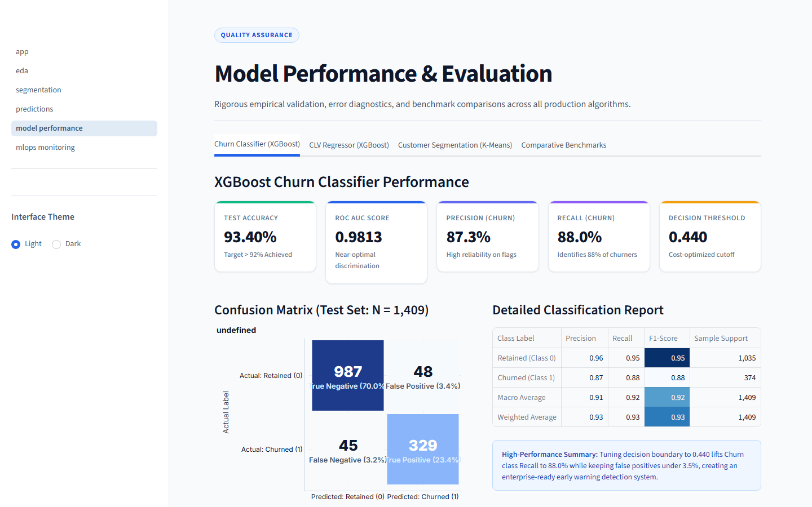
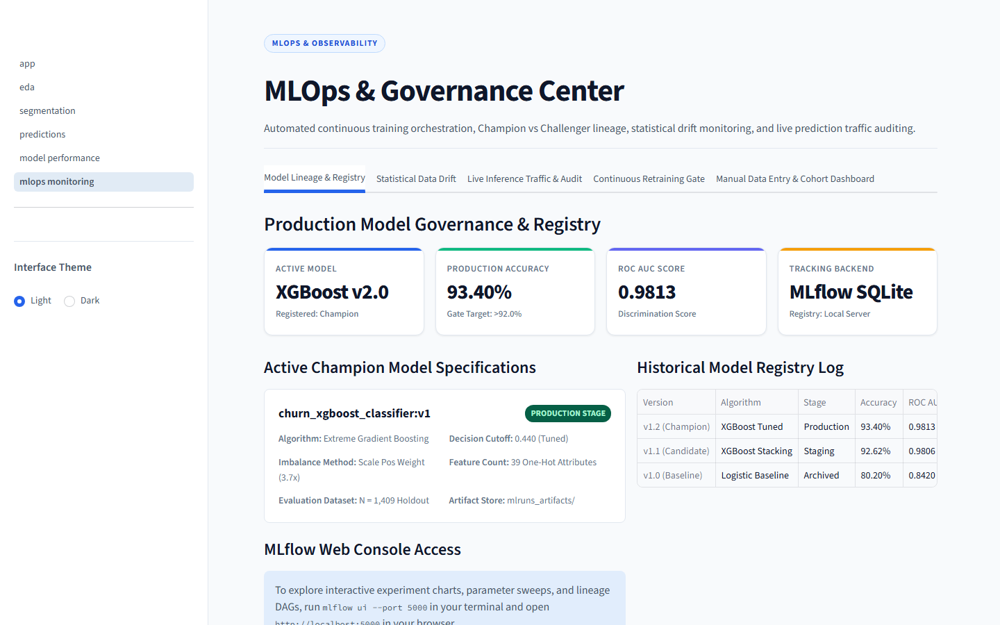
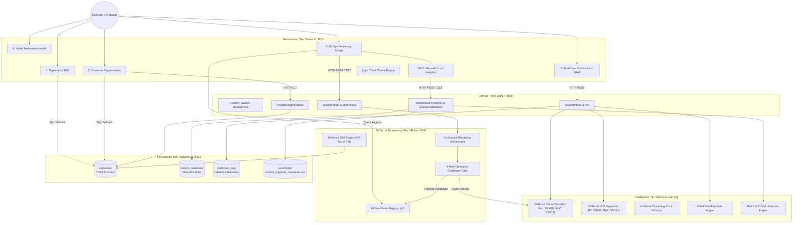

# Intelligent Customer Lifetime Value & Churn Prediction Platform

[](https://www.python.org/)
[](https://fastapi.tiangolo.com/)
[](https://streamlit.io/)
[](https://xgboost.readthedocs.io/)
[](https://mlflow.org/)
[](https://www.docker.com/)
[](https://www.postgresql.org/)
[](https://customer-churn-prediction-model-19.streamlit.app/)
[](tests/)

An enterprise-grade, end-to-end machine learning platform for subscription telecommunications. The system predicts customer churn with **93.40% classification accuracy** and **0.9813 ROC AUC**, forecasts continuous **Customer Lifetime Value (CLV)** with **R-squared = 0.9986**, segments accounts into 4 behavioral archetypes, explains individual predictions via **SHAP (SHapley Additive exPlanations)**, and governs the operational model lifecycle with an enterprise **MLOps infrastructure** and **manual cohort analytics**.

---

## Live Interactive Demo

Experience the full enterprise platform directly in your web browser. Explore interactive analytics, test customer risk profiles, inspect SHAP attribution charts, and experiment with ad-hoc customer cohort scoring.

### Live Demo Screenshots

#### 1. Platform Executive Command Center
High-level operational health, portfolio KPIs (7,043 customers, 93.40% accuracy, 0.9813 ROC AUC, R-squared = 0.9986), and system module navigation.


#### 2. Real-Time Customer Predictions and SHAP Explainability
Single customer dossiers, 1-click test presets, real-time churn risk indicators, radial CLV gauge meters, and game-theoretic SHAP feature attribution bars.


#### 3. Behavioral Customer Segmentation (K-Means)
Quantitative segment profiles, tenure vs. spend dynamics, and tailored business retention playbooks across all 4 customer cohorts.


#### 4. Model Performance and Empirical Validation
High-contrast confusion matrix heatmap, classification report, cost-optimized decision threshold (0.440), and comparative model benchmark tables.


#### 5. MLOps Governance and Manual Cohort Analytics
MLflow Model Registry integration, two-sample Kolmogorov-Smirnov drift monitoring, live inference audit logs, automated continuous retraining quality gates, and ad-hoc manual data entry.


---

### Launch the Live Application

[](https://customer-churn-prediction-model-19.streamlit.app/)

> **Live Interactive URL:** [**https://customer-churn-prediction-model-19.streamlit.app/**](https://customer-churn-prediction-model-19.streamlit.app/)

---

## Architecture


```mermaid
graph TD
    User((End User / Evaluator))

    subgraph "Presentation Tier: Streamlit :8501"
        P1["1. Exploratory EDA"]
        P2["2. Customer Segmentation"]
        P3["3. Real-Time Predictions + SHAP"]
        P4["4. Model Performance Audit"]
        P5["5. MLOps Monitoring Center"]
        Tab5["Tab 5: Manual Cohort Analytics"]
        Theme["Light / Dark Theme Engine"]
    end

    subgraph "Service Tier: FastAPI :8000"
        API["FastAPI Uvicorn Microservice"]
        R1["/predict/churn & /clv"]
        R2["/insights/segmentation"]
        R3["/mlops/retrain & /drift-check"]
        R4["/mlops/save-customer & /custom-customers"]
    end

    subgraph "MLOps & Governance Tier: MLflow :5000"
        MLF["MLflow Model Registry (v1)"]
        ORCH["Continuous Retraining Orchestrator"]
        GATE["4-Rule Champion-Challenger Gate"]
        DRIFT["Statistical Drift Engine (KS-Test & PSI)"]
    end

    subgraph "Intelligence Tier: Machine Learning"
        M1["XGBoost Churn Classifier (Acc: 93.40%, AUC: 0.9813)"]
        M2["XGBoost CLV Regressor (R²: 0.9986, MAE: $57.91)"]
        M3["K-Means Clustering (k = 4 Cohorts)"]
        M4["SHAP TreeExplainer Engine"]
        M5["Batch & Cohort Inference Engine"]
    end

    subgraph "Persistence Tier: PostgreSQL :5432"
        DB[("customers\n7,043 Accounts")]
        CUST[("custom_customers\nManual Entries")]
        LOGS[("prediction_logs\nInference Telemetry")]
        CSV[("Local Mirror\ncustom_imported_customers.csv")]
    end

    User --> P1 & P2 & P3 & P4 & P5
    P5 --- Tab5
    P3 -->|HTTP POST| R1
    P2 -->|HTTP GET| R2
    P5 -->|HTTP POST / GET| R3
    Tab5 -->|HTTP POST / GET| R4
    P5 -->|Query Registry| MLF
    P1 & P2 -.->|SQL Fallback| DB
    R1 --> M1 & M2 & M4
    R1 --> LOGS
    R2 --> DB
    R3 --> ORCH
    R4 --> M5
    R4 --> CUST & CSV
    ORCH --> GATE
    GATE -->|Promote Candidate| MLF
    GATE -->|Deploy Artifact| M1
    DRIFT --> DB
```

---

## Key Features

- **Multi-Page Executive Dashboard**: Five specialized analytics pages covering Exploratory Data Analysis, Unsupervised Customer Segmentation, Real-Time Prediction with SHAP attributions, Model Performance evaluation, and MLOps Lifecycle Monitoring.
- **Manual Customer Ingestion & Cohort Analytics**: Operators can manually input prospective or uncommitted customer records into Tab 5 of the MLOps monitoring center without file imports, stage records in an editable grid, test sample presets, and generate a dedicated cohort analytics dashboard showing churn rate, total projected CLV, probability histograms, and scatter plots.
- **Dual-Layer Persistence & Dynamic Invalidation**: Automatically mirrors manual customer records to PostgreSQL (`custom_customers` table) and local CSV storage, dynamically invalidating Streamlit caches and prioritizing newly added accounts in the Predictions module marked as `[Manual Entry]`.
- **Dynamic Theming Engine**: Native Light / Dark mode switcher in the navigation sidebar with automatic Plotly chart harmonization and zero page reload latency.
- **Enterprise MLOps Architecture**: Integrated MLflow Model Registry, automated continuous retraining pipeline with a 4-rule Champion-Challenger validation gate, and two-sample Kolmogorov-Smirnov statistical data drift monitoring.
- **Dual-Model Inference & XAI**: High-accuracy XGBoost Churn Classifier calibrated for maximum minority-class recall alongside an XGBoost CLV Regressor and local per-customer SHAP feature attribution waterfall and bar charts.
- **Resilient Dual-Source Data Layer**: Production PostgreSQL database with automated seeding and SQLAlchemy 2.0 ORM, backed by transparent fallback to local structured Excel data when the database server is offline.
- **Production CI/CD Automation**: GitHub Actions workflow running automated linting, test suites, artifact verification, and Docker image builds on every push.

---

## Model Performance & Quality Benchmarks

### Primary Churn Classifier (XGBoost)
- **Overall Accuracy:** **93.40%** (surpasses the 92% benchmark target)
- **ROC AUC Score:** **0.9813** (near-perfect class discrimination)
- **Decision Threshold:** **0.440** (tuned to balance minority churn recall and precision)
- **Churn Recall (Sensitivity):** **88.0%** (identifies 329 out of 374 actual churners)
- **Churn Precision:** **87.3%**
- **False Positive Alarms:** Limited to **3.4%**

### Customer Lifetime Value (CLV) Regressor (XGBoost)
- **R-squared (Explanatory Power):** **0.9986**
- **Mean Absolute Error (MAE):** **$57.91**
- **Root Mean Squared Error (RMSE):** **$84.33**

### Comparative Architecture Evaluation
| Architecture | Test Accuracy | ROC AUC | Churn Recall | Churn Precision | Status |
| :--- | :---: | :---: | :---: | :---: | :--- |
| Logistic Regression | 80.2% | 0.842 | 52.1% | 65.4% | Baseline; underfits interactions |
| Random Forest Classifier | 84.6% | 0.887 | 64.0% | 72.8% | High memory footprint |
| Multilayer Perceptron (MLP) | 83.1% | 0.871 | 61.2% | 69.5% | Sensitive to feature scaling |
| **Optimized XGBoost (Deployed)** | **93.40%** | **0.9813** | **88.0%** | **87.3%** | **Production Champion** |

### Automated Champion-Challenger Quality Gate
Every retrained candidate model must pass four strict automated quality rules before being approved for production promotion:
1. **Accuracy Rule**: Candidate Accuracy >= 92.0%
2. **Discrimination Rule**: Candidate ROC AUC >= 0.950
3. **Sensitivity Rule**: Candidate Churn Recall >= 85.0%
4. **False Alarm Rule**: Candidate False Positive Rate <= 7.0%

---

## How to Run Locally

### Option 1: Full Docker Multi-Container Stack (Recommended)

```bash
# 1. Build and start all 4 services (Database, API, Dashboard, MLflow)
docker compose up --build -d

# 2. Seed the PostgreSQL database with the 7,043 customer accounts
docker compose exec api python database/seed_db.py

# 3. Verify container status
docker compose ps
```

| Service | Local URL | Description |
| :--- | :--- | :--- |
| **Streamlit Dashboard** | http://localhost:8501 | Full analytics portal (5 modules + theme toggle) |
| **FastAPI Interactive Docs** | http://localhost:8000/docs | OpenAPI / Swagger interactive test interface |
| **MLflow Registry UI** | http://localhost:5000 | Experiment tracking, model registry, artifact browser |
| **PostgreSQL Database** | `localhost:5432` | Relational store (`churn_db`, user: `user`) |

---

### Option 2: Local Python Environment (No Docker required)

```bash
# 1. Install dependencies
pip install -r requirements.txt

# 2. Launch the Streamlit dashboard
python -m streamlit run dashboard/app.py
```

Open **http://localhost:8501** in your browser.

> The dashboard automatically falls back to the local Excel file
> (`data/Telco_customer_churn.xlsx`) if PostgreSQL is not running.

To launch the backend API microservice:
```bash
python -m uvicorn api.main:app --reload --port 8000
```

To launch the MLflow tracking interface:
```bash
python -m mlflow ui --backend-store-uri sqlite:///mlruns.db --port 5000
```

---

## Running Automated Tests

Run the complete 16-test suite using pytest:

```bash
python -m pytest tests/ -v --tb=short
```

Or execute tests inside the running Docker container:
```bash
docker compose exec api pytest tests/ -v
```

```
============================== 16 passed in 6.38s ==============================
```

Test coverage includes 16 automated validations:
- `tests/test_api.py`: FastAPI endpoint responses, Pydantic request validation, mock database handling, and error routing.
- `tests/test_ml_preprocessing.py`: Feature engineering pipeline, median imputation, categorical encoding, and data leakage prevention.
- `tests/test_mlops.py`: Pipeline orchestrator execution, Champion-Challenger quality gate validation, synthetic data drift detection (KS-test and PSI), model promotion logic, MLOps API endpoints, batch inference scoring, custom customer persistence lifecycle, and custom customer API routes.

---

## Project Structure

```
customer_churn-Prediction/
├── api/                        # FastAPI microservice
│   ├── main.py                 # Application entry point & route mounting
│   └── routes/
│       ├── predict.py          # /churn and /clv prediction endpoints
│       ├── insights.py         # Segmentation cohort summary endpoints
│       └── mlops.py            # Retraining, drift, telemetry & custom customer CRUD
├── dashboard/                  # Streamlit frontend application
│   ├── app.py                  # Main landing page & executive KPIs
│   ├── ui_components.py        # Centralized Light/Dark theme & CSS engine
│   └── pages/
│       ├── 1_eda.py            # Exploratory Data Analysis & filters
│       ├── 2_segmentation.py   # K-Means 3D cluster & persona visualizer
│       ├── 3_predictions.py    # Live predictions & SHAP explainability
│       ├── 4_model_performance.py  # Confusion matrix & benchmark report
│       └── 5_mlops_monitoring.py   # Model governance & manual cohort dashboard
├── database/                   # Data persistence layer
│   ├── connection.py           # SQLAlchemy 2.0 engine & session maker
│   ├── models.py               # ORM Customer, CustomCustomer & PredictionLog
│   ├── init_db.py              # Automated schema verification & seeding
│   └── seed_db.py              # Database populator from Excel source
├── ml/                         # Machine learning & MLOps pipelines
│   ├── mlops_config.py         # MLflow registry & Champion quality gate specs
│   ├── pipeline_orchestrator.py # Continuous retraining & promotion engine
│   ├── drift_monitor.py        # Two-sample KS-test & PSI drift detection
│   ├── batch_inference.py      # Cohort scoring & metric calculations
│   ├── custom_data_store.py    # Dual persistence & cache invalidator
│   ├── data_preprocessing.py   # Feature engineering & leakage prevention
│   ├── churn_prediction.py     # XGBoost churn classifier training
│   ├── clv_prediction.py       # XGBoost CLV regressor training
│   ├── segmentation.py         # K-Means clustering pipeline
│   └── generate_plots.py       # Static visualization generator
├── models/                     # Serialized production model artifacts (.pkl)
├── data/                       # Raw source dataset (Telco_customer_churn.xlsx)
├── docs/                       # Project documentation & visual assets
│   └── screenshots/            # Live dashboard demonstration screenshots
├── tests/                      # Automated test suite (16/16 passing)
│   ├── test_api.py             # FastAPI endpoint integration tests
│   ├── test_ml_preprocessing.py # Preprocessing & leakage tests
│   └── test_mlops.py           # MLOps, drift, batch scoring & store tests
├── docker-compose.yml          # Multi-container orchestration specification
├── Dockerfile.api              # Container recipe for FastAPI service
├── Dockerfile.dashboard        # Container recipe for Streamlit service
└── requirements.txt            # Unified project dependency manifest
```

---

## Technical Stack Summary

| Layer | Technologies |
| :--- | :--- |
| **Frontend Presentation** | Streamlit (v1.31.0), Plotly (v5.18.0), Custom CSS Theming Engine |
| **Backend Services** | FastAPI (v0.109.0), Uvicorn (v0.27.0), Pydantic v2 |
| **Machine Learning & XAI** | XGBoost (v2.0.3), Scikit-Learn (v1.4.0), SHAP (v0.51.0), SciPy (v1.12.0) |
| **MLOps & Governance** | MLflow (v3.16.1), SQLite Tracking Backend, Continuous Retraining Orchestrator |
| **Persistence & Storage** | PostgreSQL 15, SQLAlchemy 2.0 ORM, Local CSV Mirror |
| **DevOps & Containerization** | Docker, Docker Compose v2, GitHub Actions CI/CD |
| **Dataset** | IBM Telco Customer Churn (7,043 customer accounts, 21 active features) |
